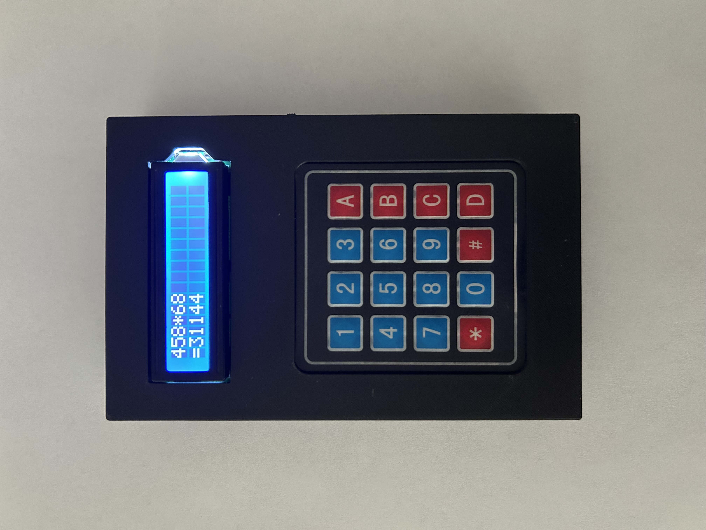
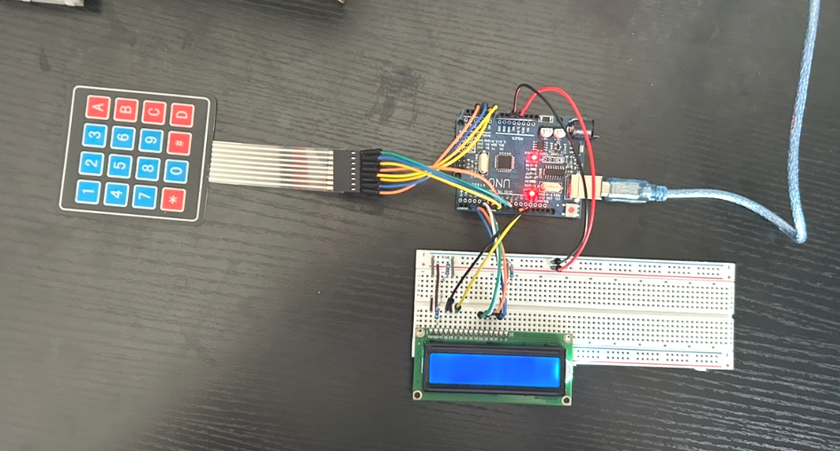
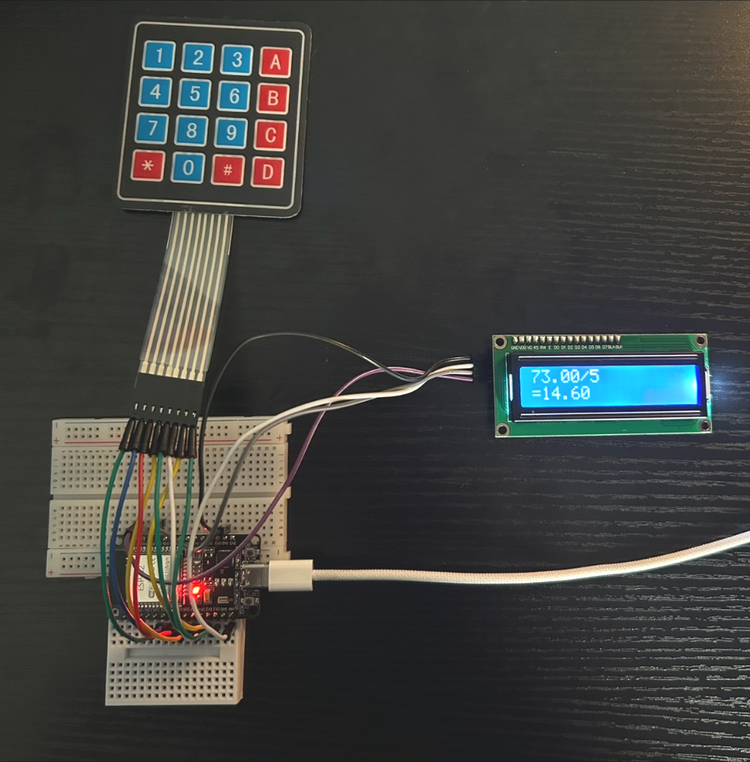
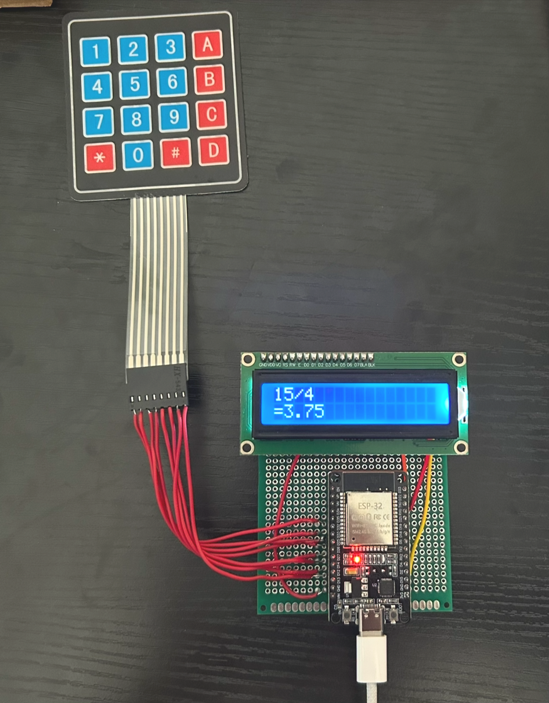
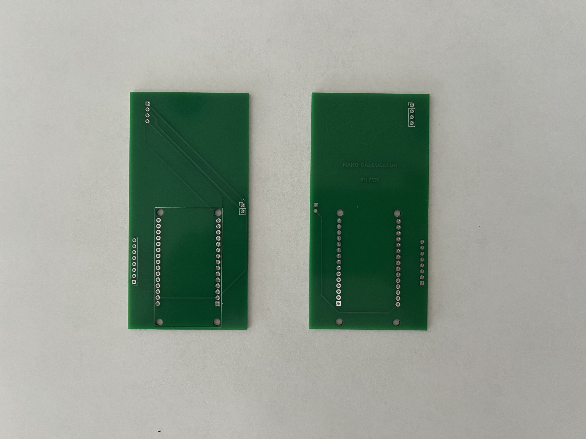
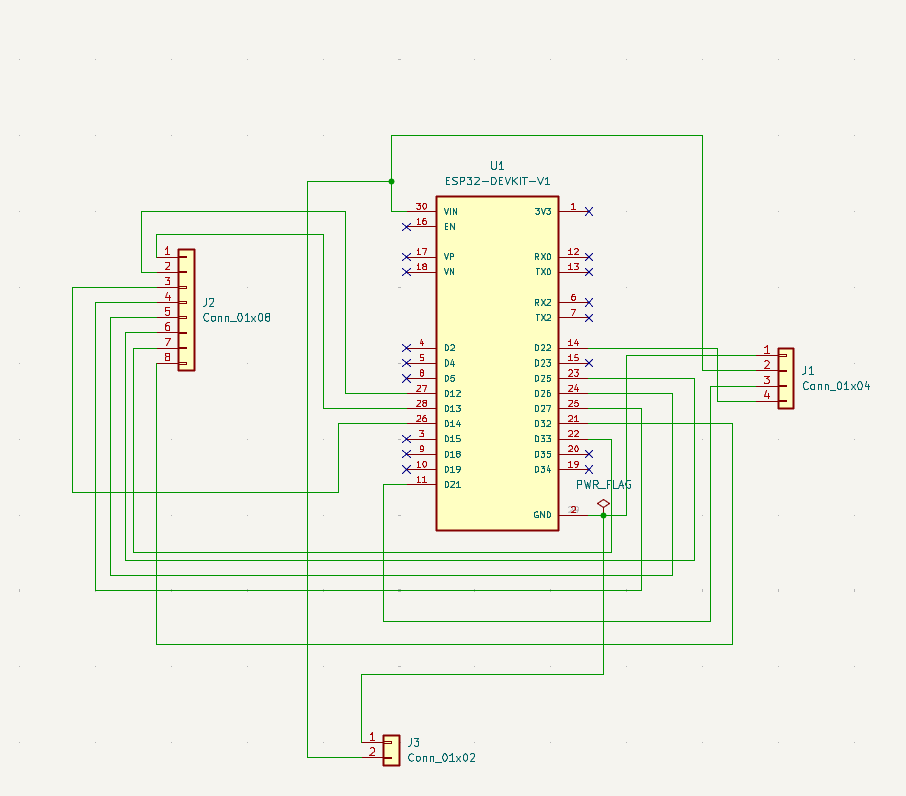
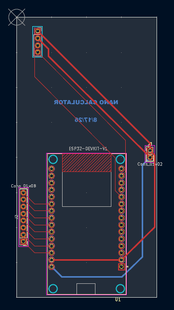
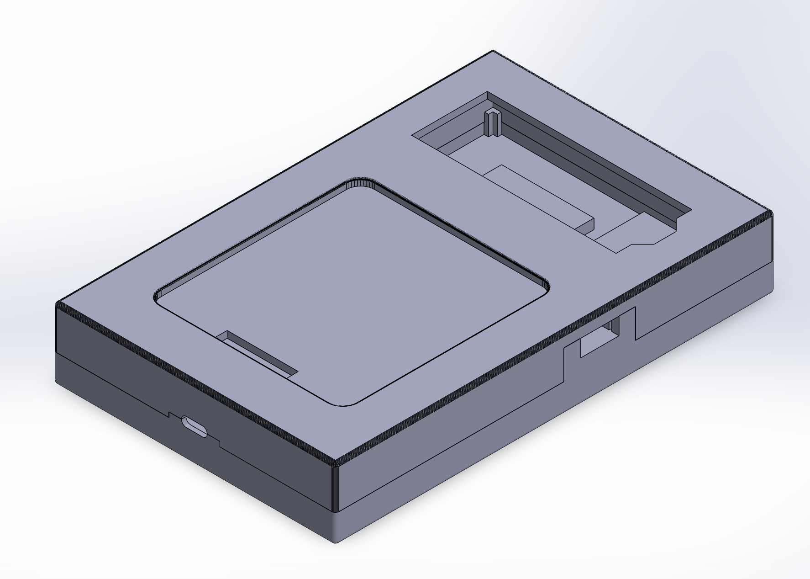
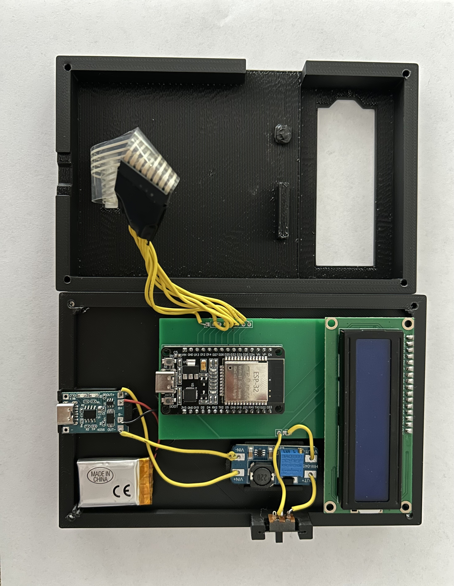

# Handheld Embedded Calculator

A fully functional handheld calculator developed from concept to physical prototype. The project combines custom C++ firmware, embedded electronics, PCB design, rechargeable power, and a 3D-printed mechanical enclosure in a compact consumer-style device.



## Project Overview

The goal of this project was to design and build a production-oriented handheld electronic device while gaining experience across the complete product-development process.

The calculator progressed through several hardware iterations: an Arduino Uno breadboard prototype, an ESP32 breadboard redesign, a perf-board validation build, a custom two-layer PCB, and a 3D-printed snap-fit enclosure.

### Key Features

- Addition, subtraction, multiplication, and division
- 4x4 matrix-keypad input
- 16x2 I2C LCD output
- Result chaining for consecutive calculations
- Divide-by-zero error handling
- ESP32-based embedded control
- Rechargeable 3.7 V power system using a TP4056 charger and MT3608 step-up module
- Custom two-layer PCB
- 3D-printed snap-fit enclosure

### Tech Stack

- C++ and Arduino framework
- ESP32
- KiCad
- SOLIDWORKS
- PCB design and manufacturing files
- Embedded systems
- 3D printing

## Development Process

### 1. Arduino Breadboard Prototype

The first prototype used an Arduino Uno to validate the calculator's computational logic, keypad input, LCD output, and firmware.



### 2. ESP32 Architecture Migration

The system was redesigned around an ESP32 and a four-pin I2C LCD interface. This reduced wiring complexity and provided a smaller platform for the handheld design.



### 3. Perf-Board Prototype

An intermediate perf-board version was built before committing to a custom PCB. This stage validated the electrical architecture, permanent connections, and power delivery.



### 4. Custom PCB

A custom two-layer PCB was designed in KiCad around the physical constraints of the enclosure. The design reduced unnecessary board area and simplified final assembly.



#### KiCad Schematic



#### KiCad PCB Layout



### 5. Mechanical Enclosure

A compact snap-fit enclosure was designed in SOLIDWORKS to integrate the display, keypad, PCB, rechargeable power electronics, and supporting hardware. Printable STL files are included in this repository.

The `calctop.SLDPRT` source file is distributed as a GitHub Release asset because GitHub's browser uploader rejected it from the main repository. The printable `calctop.STL` remains available directly in the repository.



## Final Assembly

The finished system integrates the ESP32, custom firmware, display, keypad, custom PCB, rechargeable power system, and 3D-printed enclosure.



## Firmware

The Arduino sketch is located at [`firmware/handheld_calculator/handheld_calculator.ino`](firmware/handheld_calculator/handheld_calculator.ino).

It uses these Arduino libraries:

- `Wire`
- `LiquidCrystal_I2C`
- `Keypad`

Current ESP32 pin assignments:

| Function | Pins |
| --- | --- |
| I2C SDA / SCL | GPIO 21 / GPIO 22 |
| Keypad rows | GPIO 13, 12, 14, 27 |
| Keypad columns | GPIO 26, 25, 33, 32 |

The LCD is configured as a 16x2 display at I2C address `0x27`.

## Engineering Challenges

### Cross-Domain Integration

Firmware, electronics, PCB design, power electronics, and mechanical components had to operate as one system. Electrical and mechanical decisions were developed together because changes in either area affected the final assembly.

### Spatial Constraints

The handheld form factor imposed strict space limitations. Component placement, PCB geometry, wiring, display positioning, and enclosure dimensions were optimized to reduce the overall footprint while maintaining functionality.

### Rechargeable Power System

An MT3608 step-up module, 3.7 V rechargeable battery, and TP4056 charger module were integrated to provide a rechargeable power solution for the calculator.

### Design for Manufacturability

The project was developed beyond a breadboard proof of concept. Design considerations included component placement, assembly efficiency, structural durability, PCB size, low-profile component selection, cost-effective sourcing, and reduced wiring complexity.

## Repository Structure

```text
Handheld-Embedded-Calculator/
├── README.md
├── firmware/
│   └── handheld_calculator/
│       └── handheld_calculator.ino
├── hardware/
│   ├── kicad/
│   │   └── calculator/
│   │       ├── Calc.kicad_pcb
│   │       ├── Calc.kicad_pro
│   │       └── Calc.kicad_sch
│   └── gerbers/
│       └── calculator-gerbers.zip
├── mechanical/
│   ├── solidworks/
│   │   ├── Calculator.SLDASM
│   │   ├── calcbase.SLDPRT
│   │   └── README.md
│   └── stl/
│       ├── calcbase.STL
│       └── calctop.STL
├── images/
│   └── Project photos and design images
└── docs/
    └── Project portfolio PDFs
```

## Opening the Project Files

- Open the firmware sketch with the Arduino IDE and install the `LiquidCrystal_I2C` and `Keypad` libraries if needed.
- Open `Calc.kicad_pro` in KiCad to view the schematic and PCB layout.
- Use the Gerber ZIP when viewing or ordering the PCB from a board manufacturer.
- Open the `.SLDASM` and `.SLDPRT` files in SOLIDWORKS. Download `calctop.SLDPRT` from the repository's Releases section before opening the complete assembly.
- The STL files can be opened directly in most 3D-printing slicers.

## Documentation

Printable one-page project summaries are available in the [`docs`](docs) folder.

## Author

Adriano Zagar
